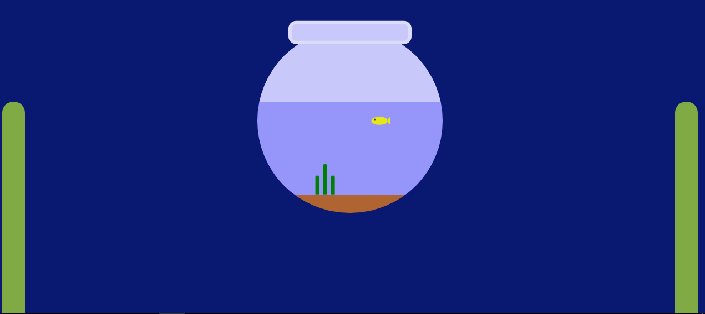

# Pure-CSS-Aquarium
An aquarium of animated fish and algae made with Pure CSS
- HTML extension
- Pure CSS
- Moving Fish
- Aquarium
- Alga
#
## Application Picture

## Codpen.io
[Codpen account link](https://codepen.io/oguzhan1881)
## Github Account Link
[Github account link](https://github.com/oguzhan18)
## Mail
oguzhancart1@gmail.com
# Instagram Account Link
[Instagram account](https://www.instagram.com/oguzhan_cart/)

